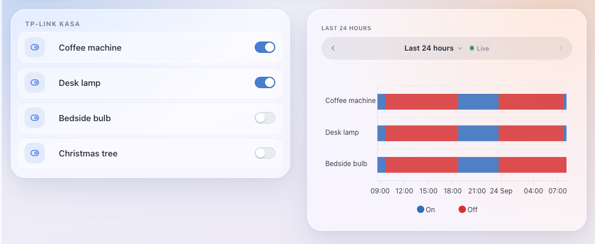
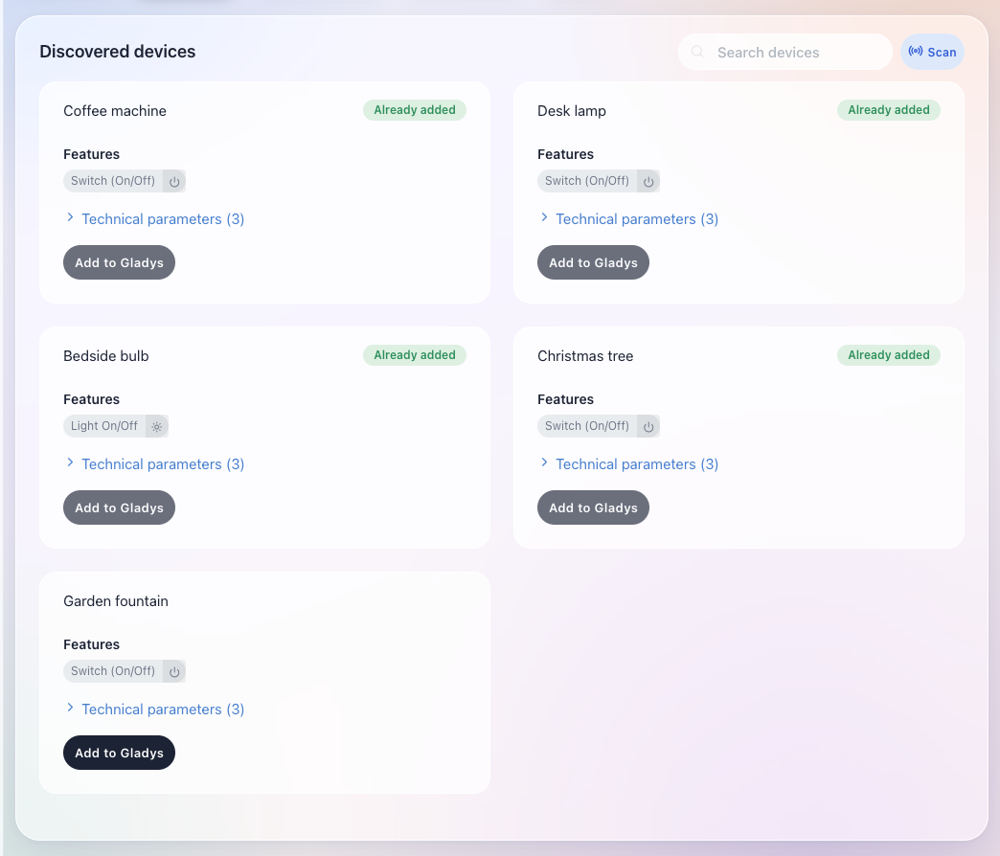

# TP-Link Kasa — Gladys external integration

Control your **TP-Link Kasa** smart plugs, switches and bulbs from
[Gladys Assistant](https://gladysassistant.com), over your local network — as an
[external integration](https://gladysassistant.com) running in its own container.

It is a port of the built-in Gladys `tp-link` service to the external-integration
model built on the JavaScript SDK
[`@gladysassistant/integration-sdk`](https://github.com/GladysAssistant/integration-sdk-js),
starting from the official
[integration template](https://github.com/GladysAssistant/integration-template-js).
Under the hood it uses the same driver as the core service,
[`tplink-smarthome-api`](https://github.com/plasticrake/tplink-smarthome-api).

## Screenshots

Plugs and bulbs on a dashboard, with their on/off history over the last 24 hours:



A scan in the **Discovery** tab lists the devices that answered, with those already added to Gladys:



_Captured on a Gladys 5.1 dashboard with simulated devices and states — values are illustrative._

## Supported devices

| TP-Link type (`sysinfo.type`)                        | Gladys device | Feature           |
| ---------------------------------------------------- | ------------- | ----------------- |
| `IOT.SMARTPLUGSWITCH`, `IOT.RANGEEXTENDER.SMARTPLUG` | Plug / switch | On/Off (`switch`) |
| `IOT.SMARTBULB`                                      | Bulb          | On/Off (`light`)  |

Other TP-Link types are detected during a scan and reported in the logs, but not
published (no controllable feature). This matches what the core service handles.

Multi-outlet strips (HS300, HS107, KP303, KP400) announce themselves as
`IOT.SMARTPLUGSWITCH` but carry their state in `sysinfo.children[]`, and a
command without a `childId` switches every outlet at once. They are detected and
skipped with an explicit log line rather than published as a plug that cannot
work — see `classify()` in `src/tplink/model.js`.

> **Local-only, legacy protocol.** Like the core service, this integration speaks
> the classic Kasa LAN protocol. Newer Kasa firmware that only exposes the
> encrypted KLAP protocol is not supported by `tplink-smarthome-api`.

## How discovery works (important)

The integration runs in a **sandboxed bridge-network container**: it cannot
broadcast onto the LAN, and Kasa devices only answer an _active_ discovery probe
(query/response). So discovery is **mediated by the Gladys core** through the SDK
`udp-active-broadcast` scan: the integration forges the encrypted Kasa discovery
request, the core — which sits on the host network — broadcasts it on UDP port
9999 and relays the raw unicast replies, and the integration decodes them. **No
IP address to configure**: on a scan the answering devices are published to the
**Discovery** tab, and the source IP each one replied from rides along as a
device param so later commands/polls reach it by unicast.

Give your Kasa devices a DHCP reservation so their IP is stable; if it changes, a
new scan picks up the new address (Gladys upserts the stored IP silently).

The scan is declared in the manifest `network_discovery` field
(`{ "type": "udp-active-broadcast", "ports": [9999] }`) — the core rejects any
capture the manifest does not declare.

## Usage in Gladys

1. Install the integration (developer mode or from the catalog).
2. Open its **Configuration** tab, pick a refresh interval, save (optional — a
   default is applied).
3. Open its **Discovery** tab and click **scan** — your devices appear.
4. Click **create** on the ones you want. They land in the **Devices** tab with
   an On/Off control, and are polled every `poll_frequency` seconds.

The refresh interval is written onto each device at discovery time, so changing
it only affects devices created by a **later** scan.

## Configuration

| Key              | Type   | Default | Description                                                                                                                                                                         |
| ---------------- | ------ | ------- | ----------------------------------------------------------------------------------------------------------------------------------------------------------------------------------- |
| `poll_frequency` | select | `60`    | How often each device is polled, in seconds. One of `1`, `2`, `10`, `15`, `30`, `60` — the only values Gladys core accepts on a published device (in milliseconds, under the hood). |

## Project structure

```
.
├─ index.js                          # SDK bootstrap + event wiring (no device logic)
├─ src/
│  ├─ config.js                      # config defaults + poll-frequency snapping
│  ├─ constants.js                   # external-id kinds, feature keys, param names
│  ├─ discovery.js                   # scan + the reporting wrapper for onScanRequest
│  ├─ deviceLookup.js                # resolve a device's address, serial and feature
│  ├─ errors.js                      # driver errors -> readable user messages
│  ├─ statePublisher.js              # publish to Gladys only what actually changed
│  ├─ setValue.js                    # onSetValue: ON/OFF command
│  ├─ poll.js                        # onPoll: refresh state
│  └─ tplink/
│     ├─ client.js                   # thin wrapper around tplink-smarthome-api (unicast)
│     ├─ protocol.js                 # Kasa discovery codec (forge request / decode reply)
│     └─ model.js                    # sysinfo -> kind, ON/OFF state, discovery payload
├─ gladys-assistant-integration.json # manifest (name, config schema, image…)
├─ Dockerfile                        # Node 24 Alpine, read-only rootfs ready
├─ .github/workflows/                # CI + multi-arch build + UI-driven release
├─ test/                             # unit tests (node --test)
└─ cover.png                         # catalog cover, 800×534 px, ≤150 KB
```

## Develop locally

```bash
npm install

GLADYS_HOST_API_URL="http://localhost:1443" \
GLADYS_INTEGRATION_TOKEN="<token-from-dev-install>" \
GLADYS_INTEGRATION_SELECTOR="tp-link" \
LOG_LEVEL=debug \
npm start
```

## Quality checks

```bash
npm run format:check   # Prettier
npm run lint           # ESLint
npm test               # unit tests (node --test)
npm run coverage       # tests + coverage thresholds (needs Node >= 22.8)
```

Validate the manifest/image/cover the way the store does, before tagging:

```bash
npx github:GladysAssistant/integration-store .
```

## Publish

1. Push this repo to GitHub and add the topic `gladys-assistant-integration`.
2. **Actions → Release → Run workflow** (`patch` / `minor` / `major`): it bumps
   the version everywhere, tags `vX.Y.Z`, and publishes the multi-arch image
   (`linux/amd64` + `linux/arm64`) to `ghcr.io`. The decentralized indexer then
   offers a one-click install/update in Gladys.

> `cover.png` is still the template's gradient placeholder (800×534 px, ≤150 KB).
> Replace it with a real cover before the integration reaches the catalog.

## License

Apache-2.0
